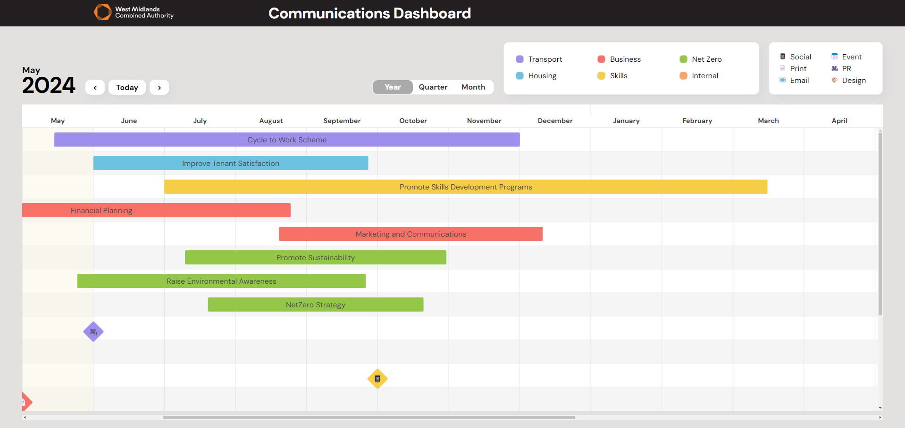
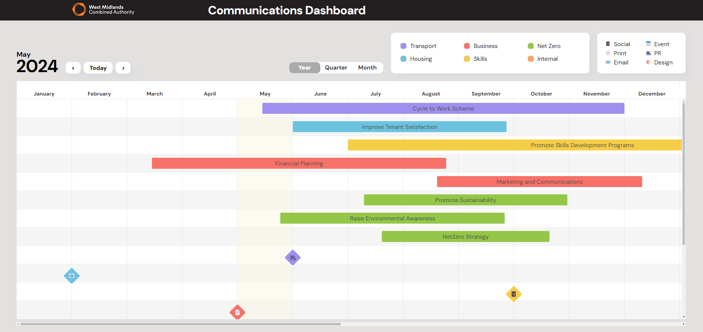
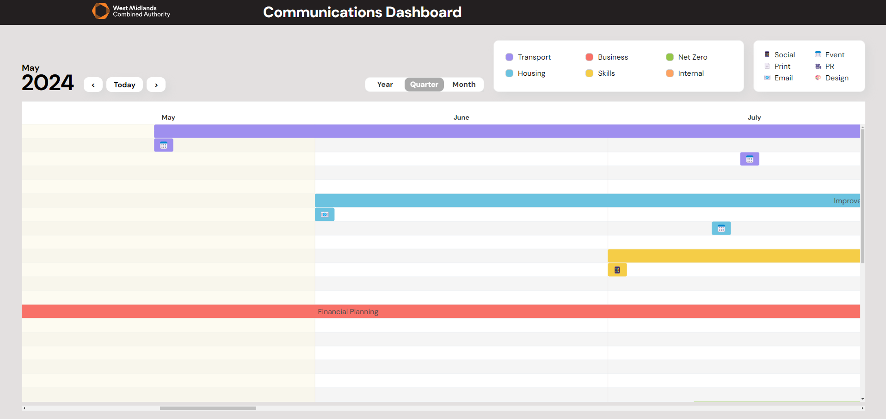
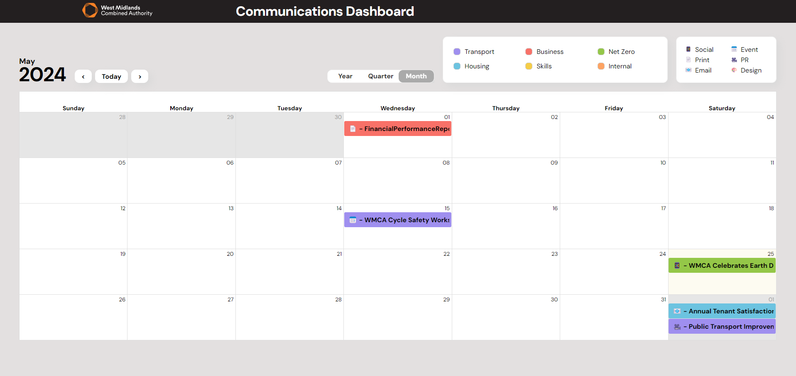
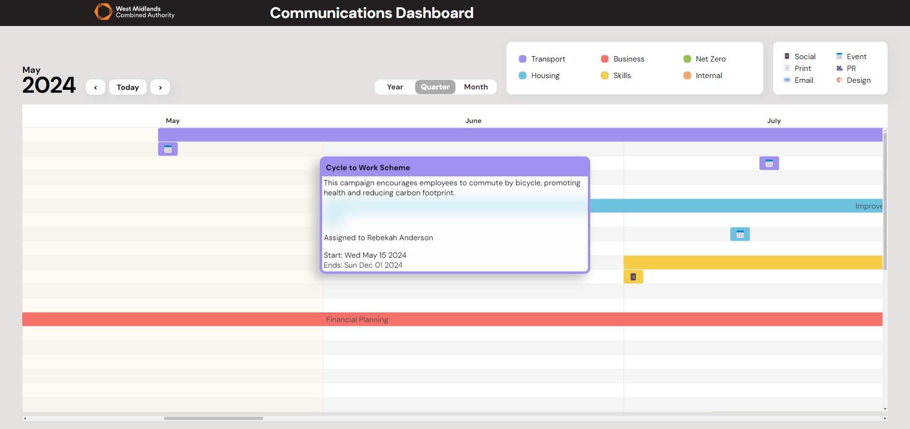
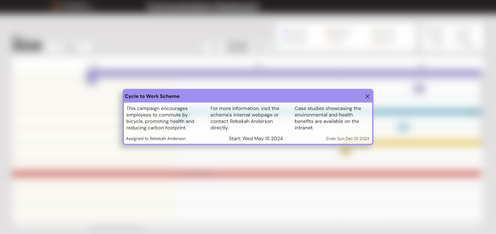
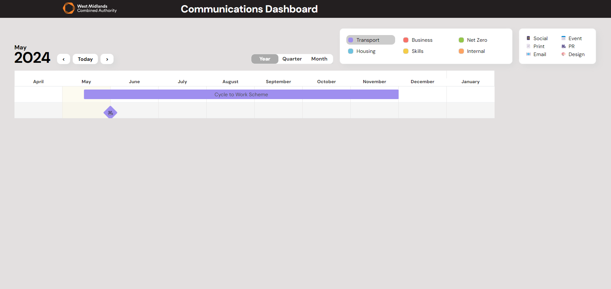

<h1 align="center">Ctrl Alt Elite</h1>
<h2 align="center">Final Project</h2>
 

West Midlands Combined Authority

<h3 align="center"> WMCA Communication Dashboard </h3>

<h2 align="center">About the project</h2>

 
This project is designed to provide a comprehensive campaign management solution 
for Campaign/Press Directors and similar roles. It is divided into three views monthly, 
quarterly, and yearly - enabling users to analyze their campaigns at both macro and micro levels.

<h2 align="center">Tech Stack</h2>

<h2 align="center">Installing this repo</h2>

<code>
git clone https://github.com/aaqeebh1/bc16-final-projects-team-ctrl-alt-elite.git
 
 
cd bc16-final-projects-team-ctrl-alt-elite.git
 
 
npm install
 
 
npm run dev
</code>

<h2 align="center">Current Features</h2>
<ul>
<li>Three views year, quarter and month
to allow for macro and micro views of data.
</li>
<h4 align="center">Year View</h4>

<h4 align="center">Quarter View</h4>

<h4 align="center">Month View</h4>

 
<li> 
On hover offers a quick blurb, dates and campaign/event owner card.
On click offers an expanded details card. Both are implemented on quarter
and month view.
</li>
<h4 align="center">OnHover</h4>

<h4 align="center">OnClick</h4>

 
<li>
Filter by department allows users to easily view specific departments, implemented on both Year and Quarter views. 
Icons on milestones provide a quick reference to the event type.
</li>
<h4 align="center">Filter</h4>

</ul>

